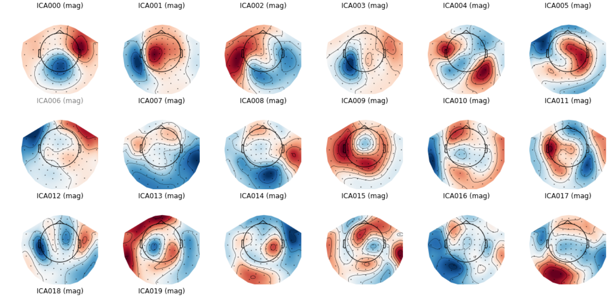

# ICA-QC

Post-ICA QC visualization and manual correction tool.


---

##  Features

- Visualize the results of Independent Component Analysis (ICA) for MEG/EEG preprocessing.
- Perform manual quality checks and override ICA-derived components as needed.
- Optionally re-apply ICA on the data.
---

##  Requirements

- MNE-python (1.3.0 and above)
- Numpy
- Matplotlib
---

##  Installation

Clone this repository:

```bash
git clone https://github.com/neurosignal/ICA-QC.git
cd ICA-QC
```
---

## Get help
```
python ica_qc.py --help
```

```
This script is meant to check the quality of ICA and 
       override the ICA application with user's own selections.
USAGE:
    - Check ICA outputs:
        python ica_qc.py --results_dir <directory>
    - Apply ICA manually:
        python ica_qc.py --ica_file <xxx_0-ica_applied.fif>             --data_file <xxx_raw_tsss.fif>                 --apply_filter --block --apply_ica
    - Help:
        python ica_qc.py --help

usage: ica_qc.py [-h] [--results_dir RESULTS_DIR] [--ica_file ICA_FILE] [--data_file DATA_FILE] [--apply_filter] [--lfreq LFREQ] [--hfreq HFREQ] [--apply_ica] [--block]

Post-ICA QC visualization tool for MEGnet (or other ICA pipelines) outputs.

optional arguments:
  -h, --help            show this help message and exit
  --results_dir RESULTS_DIR, -dir RESULTS_DIR
                        Path to MEGnet (or other ICA pipelines) results.
  --ica_file ICA_FILE, -ica ICA_FILE
                        Path to ICA-applied file.
  --data_file DATA_FILE, -data DATA_FILE
                        Raw MEG file.
  --apply_filter        Apply bandpass filter before plotting.
  --lfreq LFREQ         Low cutoff for bandpass filter.
  --hfreq HFREQ         High cutoff for bandpass filter.
  --apply_ica           Apply ICA manually on raw data.
  --block               Block GUI for plots.

```
## Use cases
- Check 

## Contribution
Contributions are most welcome! Please open an issue or submit a pull request.

## License
See `LICENSE` for details.